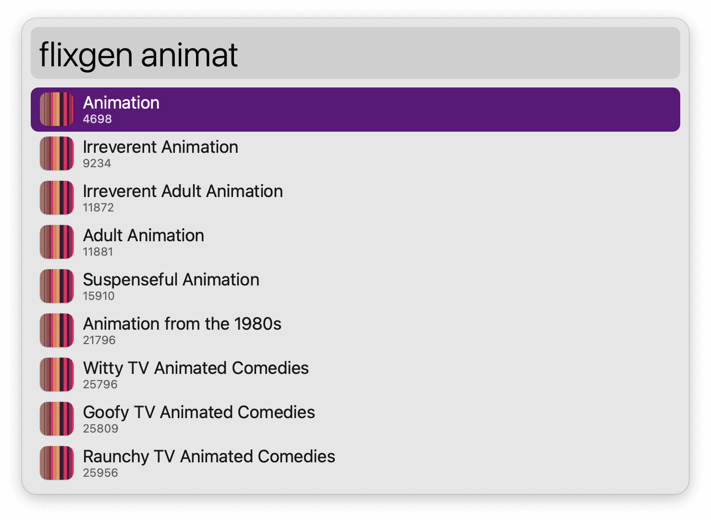

#  Streaming Genres Alfred Workflow

Filter through thousands of Netflix genres

<a href='https://github.com/alfredapp/streaming-genres-workflow/releases/latest/download/Streaming.Genres.alfredworkflow'>⤓ Download Workflow</a>

## Usage

Run the Genres Keyword (default: `flixgen`) to filter through thousands of Netflix genres. <kbd>⏎</kbd> to open in the default web browser.

